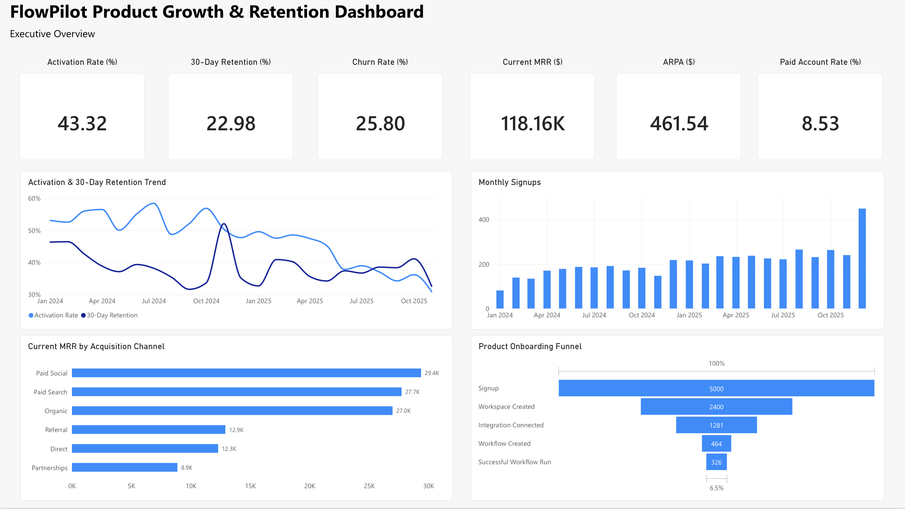
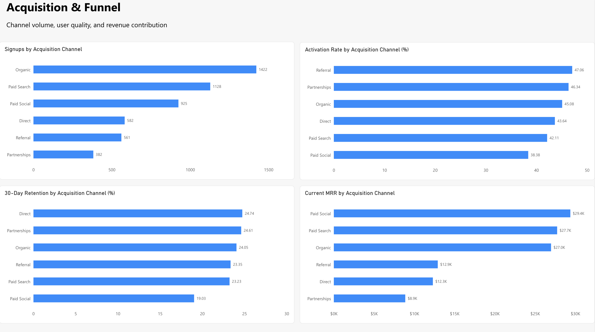
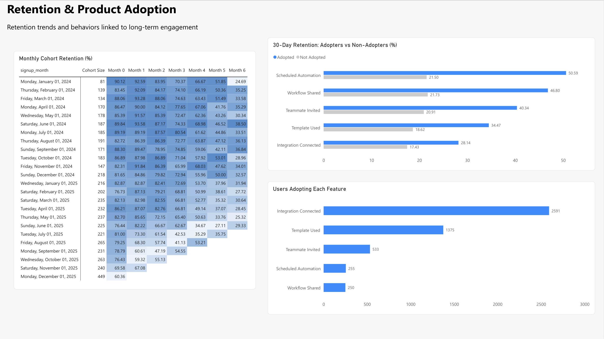
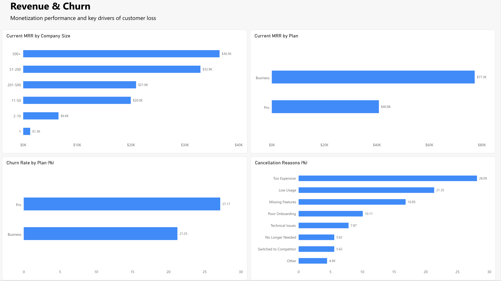
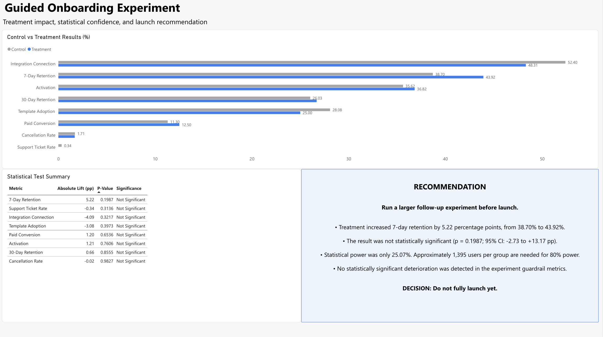

# FlowPilot SaaS Product Growth & Retention Analytics

End-to-end product analytics portfolio project for a fictional B2B SaaS company. The project uses SQL, Python, experimentation, and Power BI to identify where users drop from the onboarding funnel, which acquisition channels bring valuable customers, which product behaviors are associated with retention, and whether a guided-onboarding experiment should launch.

> **Business question:** FlowPilot is growing signups, but are those users activating, converting, and remaining engaged—and what should the company improve next?



## Project Overview

FlowPilot is a fictional freemium SaaS platform that helps small and midsized teams automate repetitive workflows using AI. Users can connect third-party tools, create workflows, run automations, invite teammates, share workflows, and create scheduled automations.

This project follows a complete analyst workflow:

**Business question → SQL analysis → Python experimentation → Power BI dashboard → Insights → Recommendations**

The analysis covers:

- product onboarding and activation
- acquisition-channel quality
- 7-day and 30-day retention
- cohort retention
- feature adoption
- subscription churn
- MRR and customer segments
- A/B experiment evaluation

## Tools and Skills

- **PostgreSQL / DBeaver:** data loading, validation, joins, CTEs, window functions, funnel analysis, cohorts, retention, churn, and revenue analysis
- **Python / Jupyter:** experiment validation, two-proportion z-tests, confidence intervals, power analysis, and visualization
- **Power BI Service:** KPI cards, trends, funnel analysis, cohort heatmap, channel comparisons, revenue and churn reporting, and experiment communication
- **Excel / CSV:** dashboard-ready data exports and semantic-model preparation
- **Git / GitHub:** version control, documentation, and portfolio presentation

## Dataset

The synthetic dataset models a B2B SaaS product with eight relational tables.

| Table | Rows |
|---|---:|
| `accounts` | 3,000 |
| `users` | 5,000 |
| `acquisition` | 5,000 |
| `events` | 100,174 |
| `subscriptions` | 345 |
| `payments` | 2,528 |
| `experiments` | 588 |
| `support_tickets` | 749 |

## KPI Definitions

### Product funnel

**Signup → Workspace Created → Integration Connected → Workflow Created → Successful Workflow Run**

### Activation

A user is activated after completing at least one successful workflow run within seven days of signup.

### Retention

- **7-day retention:** meaningful product activity during days 7–13 after signup
- **30-day retention:** meaningful product activity during days 30–36 after signup
- Login alone does not count as meaningful activity.

## Key Findings

### 1. Onboarding has a major downstream drop-off

- 5,000 users signed up, but only 326 reached a successful workflow run.
- The largest downstream bottleneck was **Integration Connected → Workflow Created**, with only **36.22%** progressing.
- Overall activation was **43.32%**.
- Users who connected an integration and used a template reached **77.45% activation**, compared with **25.84%** for users who did neither.

### 2. Acquisition volume and customer quality are not the same

- Organic generated the most signups: **1,422**.
- Referral produced the highest activation rate: **47.06%**.
- Direct produced the highest 30-day retention rate: **24.74%**.
- Paid Social had the lowest activation and retention rates, yet generated the most current MRR at **$29.4K**.

This means acquisition decisions should consider revenue contribution alongside early product engagement rather than judging channels on a single metric.

### 3. Activation strongly predicts retention

| User group | 7-Day retention | 30-Day retention |
|---|---:|---:|
| Activated | 54.11% | 34.07% |
| Not activated | 27.91% | 14.50% |

Activated users were substantially more likely to remain engaged, reinforcing the importance of helping new users reach their first successful workflow quickly.

### 4. Collaborative and recurring-use features are associated with retention

Thirty-day retention among feature adopters was highest for:

- Scheduled Automation: **50.59%**
- Workflow Shared: **46.80%**
- Teammate Invited: **40.34%**
- Template Used: **34.47%**
- Integration Connected: **28.14%**

Scheduled automation and workflow sharing had the strongest retention association but the lowest adoption, creating a clear product-discovery opportunity.

### 5. Larger customers drive most revenue

- Current MRR: **$118,155**
- ARPA: **$461.54**
- Paid-account rate: **8.53%**
- Accounts with 51 or more employees contributed **76.45%** of total MRR.
- Business subscriptions generated **$77.3K** in MRR, compared with **$40.8K** from Pro subscriptions.

### 6. Churn is led by price and weak engagement

- Overall subscription churn: **25.80%**
- Pro churn: **27.17%**
- Business churn: **21.25%**
- The leading cancellation reasons were Too Expensive (**28.09%**), Low Usage (**21.35%**), Missing Features (**16.85%**), and Poor Onboarding (**10.11%**).

## Guided Onboarding Experiment

The treatment guided users through:

**Connect an Integration → Choose a Workflow Template → Run the First Workflow**

| Metric | Control | Treatment | Absolute lift |
|---|---:|---:|---:|
| Activation | 35.62% | 36.82% | +1.21 pp |
| 7-Day Retention | 38.70% | 43.92% | +5.22 pp |
| 30-Day Retention | 26.03% | 26.69% | +0.66 pp |
| Paid Conversion | 11.30% | 12.50% | +1.20 pp |

The 7-day retention lift was promising, but the result was not statistically significant:

- **p-value:** 0.1987
- **95% confidence interval:** -2.73 to +13.17 percentage points
- **Observed statistical power:** 25.07%
- **Required sample size for 80% power:** approximately 1,395 users per group
- **Actual sample:** 292 Control and 296 Treatment users

**Decision: Do not fully launch yet. Run a larger follow-up experiment.**

## Power BI Dashboard

### Page 1 — Executive Overview

High-level KPIs, monthly trends, channel MRR, and the product-onboarding funnel.

The Executive Overview is shown at the top of this README.

### Page 2 — Acquisition & Funnel

Channel comparisons across signup volume, activation, 30-day retention, and current MRR.



### Page 3 — Retention & Product Adoption

Monthly cohort retention, adopter versus non-adopter retention, and feature-adoption volume.



### Page 4 — Revenue & Churn

MRR by company size and plan, churn by plan, and cancellation reasons.



### Page 5 — Experiment Results

Control-versus-treatment outcomes, statistical-test results, and the launch recommendation.



## Business Recommendations

1. **Reduce the workflow-creation bottleneck.** Guide users from integration connection directly into a relevant template and first workflow.
2. **Promote retention-linked features earlier.** Surface scheduled automation, workflow sharing, and teammate invitations during onboarding and early lifecycle messaging.
3. **Manage acquisition by both quality and revenue.** Improve Paid Social onboarding rather than cutting the channel solely because of weaker activation and retention.
4. **Prioritize larger-account growth.** Build acquisition, onboarding, and expansion strategies for organizations with 51 or more employees.
5. **Address price and low usage together.** Improve value communication, lifecycle education, and usage-based intervention before cancellation.
6. **Rerun the guided-onboarding experiment at sufficient power.** Target approximately 1,395 users per variant before making a full-launch decision.

## Repository Structure

```text
flowpilot-saas-growth-retention-analytics/
├── README.md
├── sql/
│   ├── 01_product_funnel_analysis.sql
│   ├── 02_activation_analysis.sql
│   ├── 03_retention_analysis.sql
│   ├── 04_cohort_analysis.sql
│   ├── 05_churn_analysis.sql
│   ├── 06_revenue_analysis.sql
│   ├── 07_experiment_analysis.sql
│   └── 08_dashboard_queries.sql
├── notebooks/
│   └── 01_experiment_analysis.ipynb
├── data/
│   └── Power BI-ready CSV and Excel exports
├── dashboard/
│   └── Dashboard supporting files
├── images/
│   ├── 01_executive_overview.png
│   ├── 02_acquisition_funnel.png
│   ├── 03_retention_product_adoption.png
│   ├── 04_revenue_churn.png
│   ├── 05_experiment_results.png
│   └── guided_onboarding_experiment_results.png
└── docs/
    └── Project documentation
```

## Analysis Files

- [`01_product_funnel_analysis.sql`](sql/01_product_funnel_analysis.sql)
- [`02_activation_analysis.sql`](sql/02_activation_analysis.sql)
- [`03_retention_analysis.sql`](sql/03_retention_analysis.sql)
- [`04_cohort_analysis.sql`](sql/04_cohort_analysis.sql)
- [`05_churn_analysis.sql`](sql/05_churn_analysis.sql)
- [`06_revenue_analysis.sql`](sql/06_revenue_analysis.sql)
- [`07_experiment_analysis.sql`](sql/07_experiment_analysis.sql)
- [`08_dashboard_queries.sql`](sql/08_dashboard_queries.sql)
- [`01_experiment_analysis.ipynb`](notebooks/01_experiment_analysis.ipynb)

## Project Status

- [x] PostgreSQL database setup and validation
- [x] SQL product, retention, churn, revenue, and experiment analysis
- [x] Python statistical testing and power analysis
- [x] Power BI dashboard data preparation
- [x] Five-page Power BI dashboard
- [x] Business recommendations
- [x] Portfolio documentation

---

*This project uses synthetic data and was created as a portfolio case study. FlowPilot is a fictional company.*
